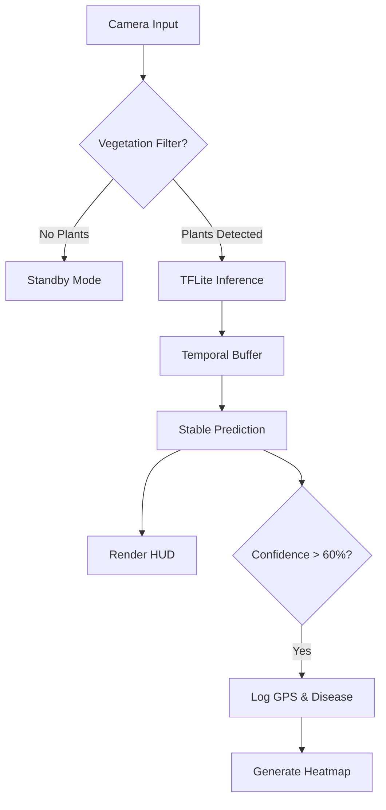

# 🚁 Plant Doctor Edge: Autonomous Drone Navigation System


This repository contains the **Edge Computing** logic for an agricultural inspection drone. It is designed to run on low-power devices (like Raspberry Pi 4, Jetson Nano, or standard laptops) to perform real-time disease detection in crop fields without internet connectivity.

The system integrates **Computer Vision (OpenCV)** for resource optimization and **Deep Learning (TFLite)** for precision diagnosis, providing immediate actionable intelligence via heatmaps.

## 🌟 Key Features

### 1. 🧠 Hybrid Vision Pipeline (The "Gatekeeper")
To save battery and CPU cycles, the system uses a cascaded architecture:
* **Stage 1 (HSV Filtering):** A lightweight Computer Vision algorithm checks if the camera is looking at vegetation (green/yellow spectrum).
* **Stage 2 (Deep Inference):** The heavy Neural Network (EfficientNetB0) is **only** triggered if vegetation is detected ($>20\%$ frame coverage).
* **Result:** Prevents false positives on non-plant objects and reduces energy consumption.

### 2. ⚡ Temporal Smoothing (Anti-Flicker)
Raw frame-by-frame predictions can be unstable due to sensor noise. We implemented a **Voting Buffer (Deque)** that aggregates the last 10 frames to output a stable, democratic prediction, eliminating UI flickering.

### 3. 🎮 VG-Grade HUD
A real-time **Head-Up Display** overlay for the operator:
* **Dynamic Target Box:** Changes color based on threat level (Red=Fusarium, Yellow=Deficiency, Green=Healthy).
* **Status Alerts:** Clear text warnings for critical pathologies.
* **Telemetry:** Simulated GPS coordinates updated in real-time.

### 4. 🗺️ Offline Cartography
Post-flight analysis generates an interactive **HTML Heatmap** using `folium`. It plots the drone's path and highlights infection hotspots using GPS telemetry logged during the flight.

## 🛠️ Architecture



## 📂 Project Structure
```mermaid
PlantPathology_Edge/
├── models/
│   └── plant_doctor_thor.tflite  # EfficientNetB0 (INT8/Float32 Quantized)
├── output/                       # Generated Mission Reports (.html)
├── drone_brain_v4.py             # Main Flight Logic (The "Brain")
└── requirements.txt              # Dependencies
```

## 🚀 Installation & Usage

1. **Prerequisites**
* Python 3.9+
* Webcam (for simulation)

2. **Install Dependencies**
```bash
pip install -r requirements.txt
```

3. **Setup Model**
Ensure you have the trained TFLite model in the `models/` directory. *(Note: The model is not included in the repo due to size constraints. Download it from the Research repo or Azure Storage).*

4. **Fly!** 🚁
Run the main script to start the simulation:
```bash
python drone_brain_v4.py
```

* **TEST_MODE:** Set TEST_MODE = True in the script to bypass the vegetation filter for indoor testing.

* **Controls:** Press Q to land (exit) and generate the map.

## 📊 Outputs
After the flight, check the `output/` folder. You will find a mission_report_YYYYMMDD.html file containing:
* **Flight Path:** Blue markers for the drone's trajectory.

* **Infection Clusters:** Red heatmaps indicating areas with high density of Fusarium or Leaf Deficiency.

##
*Authored by Carlos Luis Noriega - Lead AI Engineer*